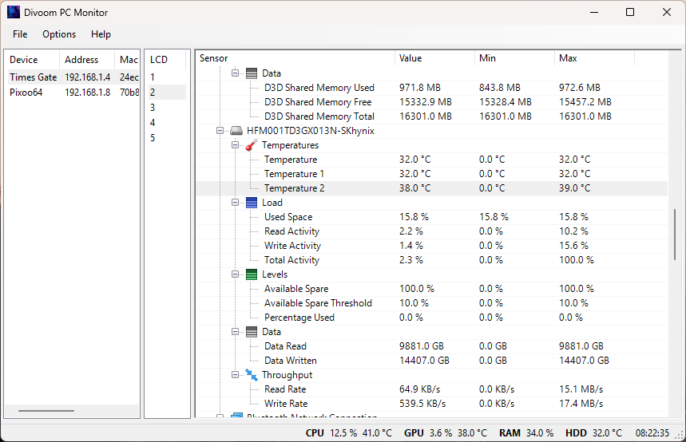

# divoom.net and pcMonitor

## Overview
divoom.net is a .NET 8 project that provides a library for interacting with Divoom devices. This 
library allows developers to control and retrieve information from Divoom devices programmatically.

The repository also contains a PC monitor application that sends PC sensor data to a Divoom device.
This is my attempt to update of the [Divoom.pcMonitor](https://github.com/DivoomDevelop/DivoomPCMonitorTool) project 
by [Divoom Develop](https://github.com/DivoomDevelop). I felt that this would be a good demonstration of the divoom.net 
library. For more information on the Divoom.pcMonitor project, see the [README.md](Divoom.pcMonitor/README.md) file.



## Features
- Connect to Divoom devices
- Send commands to control the device
- Retrieve device status and information
- Support for various Divoom device models

## Getting Started

To get started, clone the repository and build the project. Run the Divoom.pcMonitor application and follow the on-screen
instructions to connect to your Divoom device. 

To use the divoom.net library in your own project, add a reference to the Divoom library and use the classes and methods.

### Prerequisites
- .NET 8 SDK

### Usage
Here are some simple examples of how to use the library:

#### Find all Divoom devices on the local network
```csharp
using Divoom;

namespace TestApp;

internal class Program
{
    static void Main()
    {
        // Find all Divoom devices on the local network
        var devices = Service.FindDevices().Result.ToList();
        
        Console.WriteLine($"Found {devices.Count()} devices");
        foreach (var d in devices)
        {
            Console.WriteLine($"Device: {d.Name} {d.Id} {d.IpAddress} {d.MacAddress} {d.Hardware}");
        }
    }
}
```

#### Connect to a Divoom device and set the brightness, also retrieve device settings.

```csharp

using Divoom;
using Divoom.Models;

namespace TestApp;

internal class Program
{
    static void Main()
    {
        var deviceInfo = new DeviceInfo { IpAddress = "192.168.1.4" };
        
        var timeBox = new Device(deviceInfo);
        
        // Set brightness to 50%
        if(timeBox.SetBrightness(50))
            Console.WriteLine("Brightness set successfully");

        // Get all settings
        var settings = timeBox.GetAllSettings();

        // Display the date format
        Console.WriteLine($"dateFormat: {settings.DateFormat}");
    }
}
```

## Contributing
Contributions are welcome! Please open an issue or submit a pull request.

## License
This project is licensed under the MIT License. See the LICENSE file for details.
